# CNNbirdseye
Example predictions on the validation set:
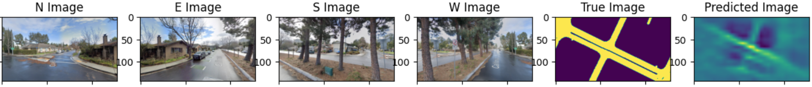
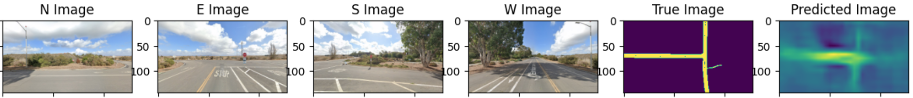
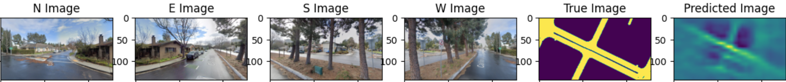
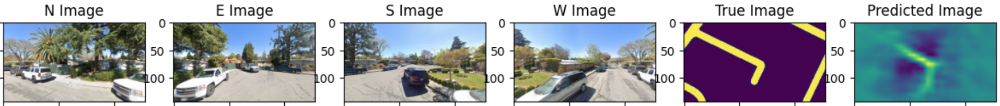
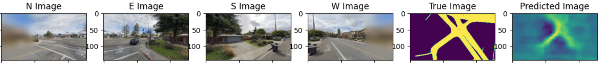

One task for autonomous driving is to extract the birds-eye view (BEV) given the visual input captured by the vehicles cameras. It can be used for navigation and path planning of the vehicle [Reiher, Lennart, Bastian Lampe, and Lutz Eckstein (2020)]:
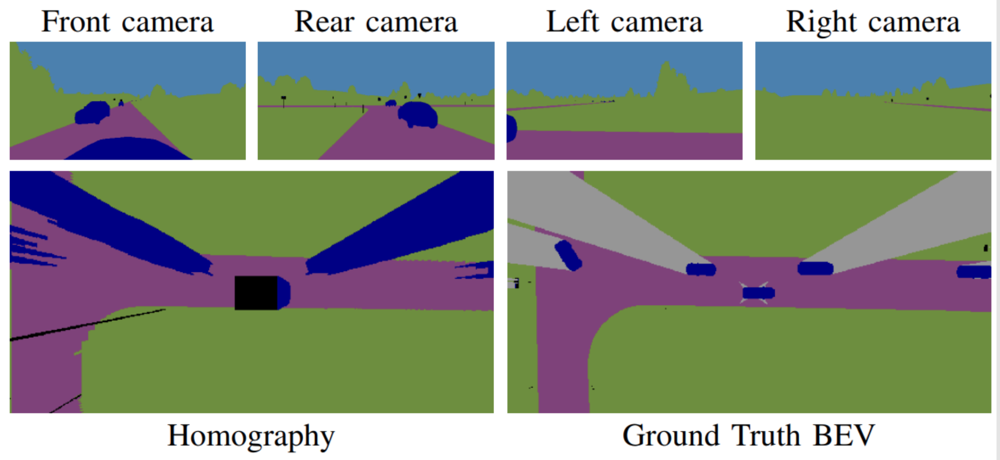
  
Steps to the task:
1. Crawling for 2000 Google-Street Views (2000*4 images, north, east, south west) and the overhead BEV from the map. 
2. Image augmentation steps
3. Finetuning an image segmentation model, Deeplab-V3 []. 

Training sample:
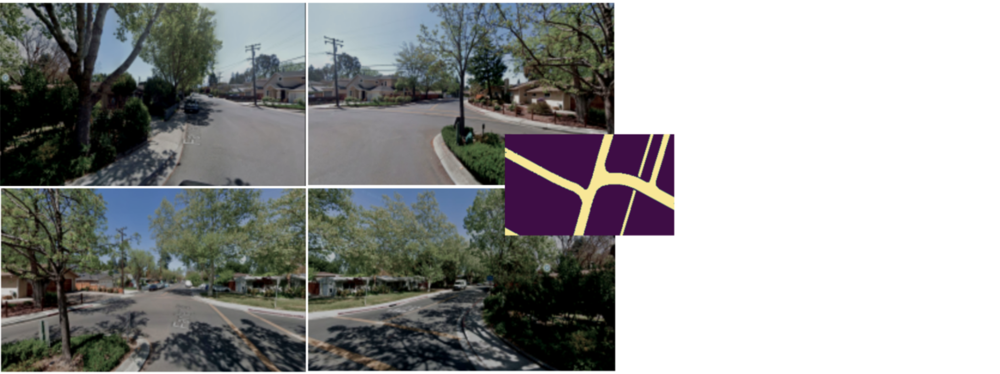

Later layers of the CNN contain the atrous spacial pyramid pooling (ASPP) which allows the model to observe the local and global context simultaneously, suitable for image segmentation tasks [Chen, Liang-Chieh, et al.(2017)]:
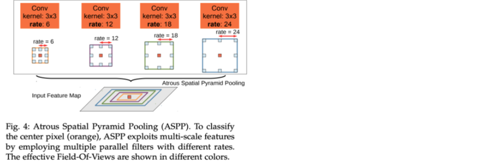

To include all four images, after the third ResNet layer, channels of the four images are simply concatenated.  

The loss used is pixel-wise cross-entropy. A "loss mask" is applied to the loss respecting the target BEV. The model should be especially confident in the center of the BEV, outer regions the model might not be able reconstruct when the visual input is not sufficent. (Weights: red: 1, yellow: 0.5, outer: 0.05):
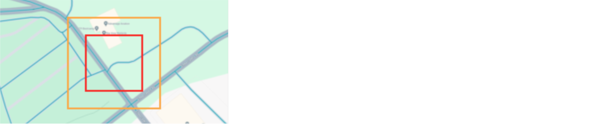

The model is trained for 140 epochs:
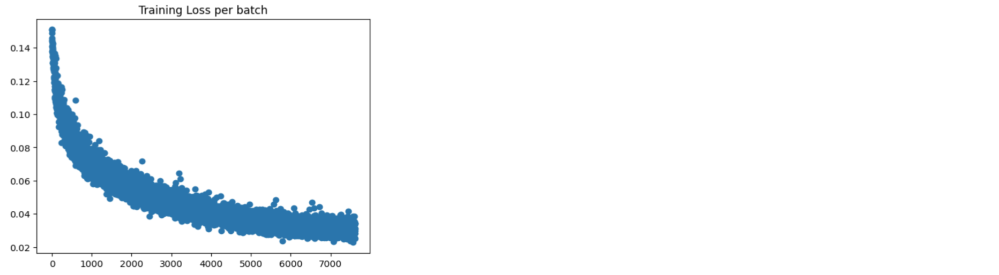

Validation loss increases after epoch 50, as the training set is not sufficiently large:
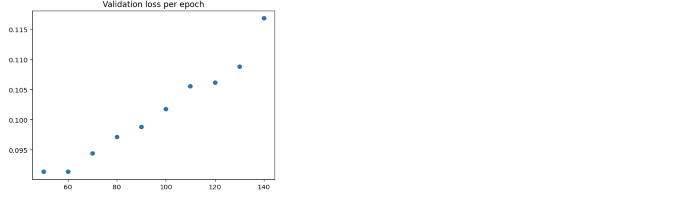

(Visualized results: see at the beginning)